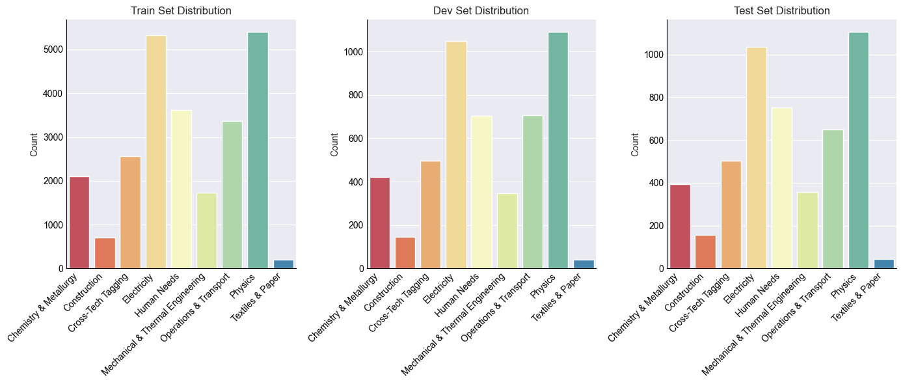
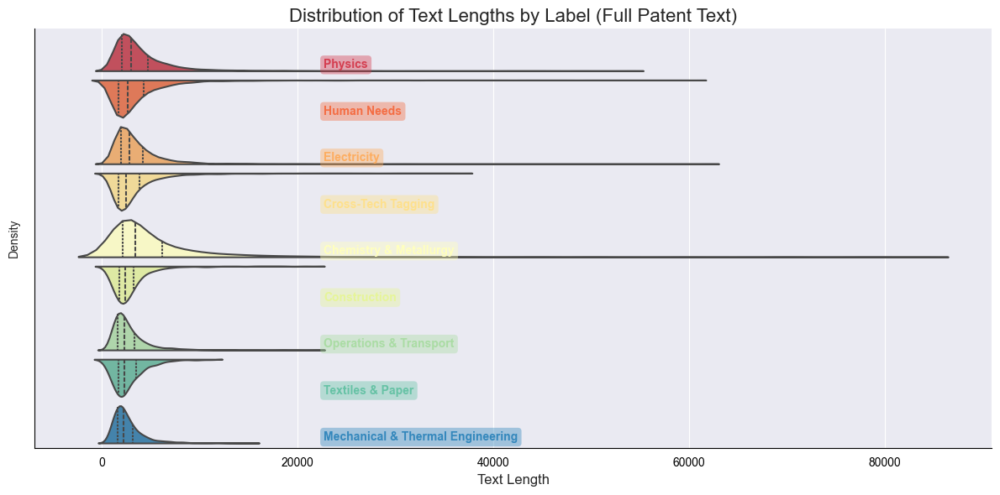
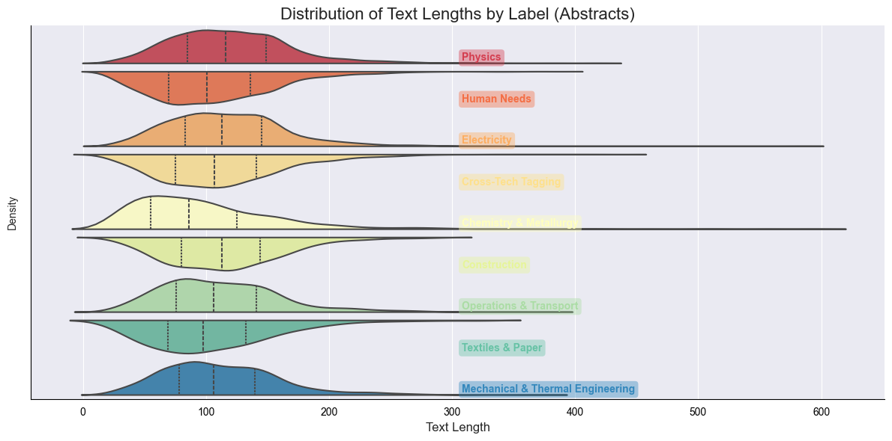
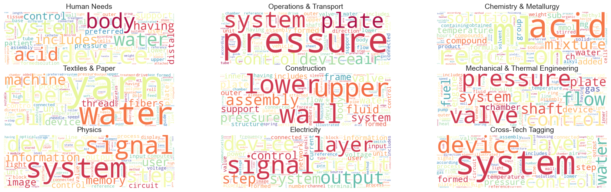
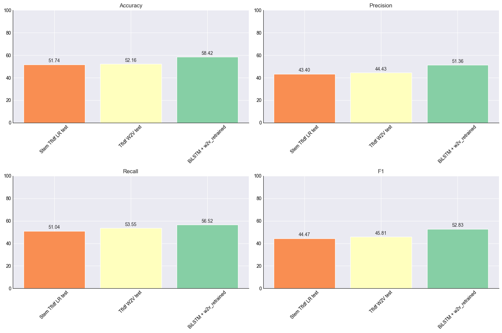

<h1 align="center">Patent Classification with Transformers</h1>
<p align="center">
  <b>Advanced NLP - Final Project</b><br>
  <b>Ferran Boada Bergadá, Lucia Sauer, Julian Romero & Moritz Peist</b><br>
  Barcelona School of Economics · 2025 
</p>

<p align="center">
  

  
  

</p>

---


## 🧠 Project Overview

This project focuses on **classifying patent documents** using only their abstracts into 9 categories based on the **Cooperative Patent Classification (CPC)** scheme. We leverage the [`ccdv/patent-classification`](https://huggingface.co/datasets/ccdv/patent-classification) dataset from Hugging Face, which originates from **Google Patents Public Datasets via BigQuery** (Google, 2018).

Originally designed for **abstractive summarization**, this dataset is repurposed here for **multi-class classification**. It consists of:
- **25,000 training samples**
- **5,000 samples for validation and testing respectively**
- Abstract patent texts and associated 9 CPC labels

### 📊 Dataset Distribution

The dataset shows strong class imbalance, with most patents concentrated in a few categories—especially from fast-evolving fields like electronics and healthcare. This is common in patent corpora and follows a Pareto-like distribution, as noted by [Benzineb & Guyot (2011)](#ref1).

To evaluate performance on our imbalanced dataset, we use the **Weighted F1** score. It accounts for both precision and recall across all classes, while weighting each class by its frequency—providing a balanced view that reflects real-world class distributions.


<div align="center">

</div>

Patent documents are inherently long and complex, typically comprising multiple sections such as the **title**, **abstract**, **detailed description**, and **claims**. As illustrated in the plots below, the length of full patent texts varies dramatically across categories, with a **heavily right-skewed distribution** and some documents reaching up to **80,000 tokens**.

This high variability introduces significant **computational and modeling challenges**, especially for transformer-based architectures, which are generally constrained by maximum input lengths (e.g., 512 or 1024 tokens). Feeding full patent texts into such models often requires aggressive truncation or specialized architectures, increasing complexity.

To simplify the problem, we instead use **only the abstract section** of each patent. As shown in the side-by-side plots, abstracts are not only **substantially shorter**, but also exhibit a **more consistent distribution** across categories. This reduction in length:

- Decreases memory and computational requirements,
- Enables the use of standard transformer models without modification,
- And still captures essential semantic content for classification.

Thus, focusing on abstracts offers a practical trade-off between model efficiency and task relevance.


<table>
  <tr>
    <td></td>
    <td></td>
  </tr>
</table>


To explore vocabulary differences across categories, the following word clouds visualize the most frequent terms per class. While **domain-specific terms** clearly emerge, many words are **shared across categories**, introducing ambiguity and making it harder for models to distinguish between classes. Additionally, patents often contain **dense scientific language** and are **intentionally phrased in complex or obfuscated ways**—either to avoid plagiarism or obscure related inventions. These characteristics amplify the challenge of accurate classification, as key signals may be both rare and linguistically subtle.


<div align="center">
  
</div>

---

## 🎯 Objective, Challenges & Relevance

The goal of this project is to **automate the classification of patents** into CPC categories using modern Transformer-based models. Accurate classification is critical for routing patents to the right domain experts, accelerating the innovation pipeline and reducing administrative burden.

However, the task comes with significant challenges:
- The dataset is **highly imbalanced**, reflecting real-world skew in patent filings.
- **Patent texts are long**, often surpassing the 512-token limit of base Transformer models, which we simplify by only using the abstracts.
- **Technical vocabulary** and subtle distinctions between classes add further complexity.

Despite these challenges, **automating patent classification** has important real-world impact. It helps address the increasing volume and complexity of patent filings, reduces manual workload for experts, and ensures more consistent and scalable classification—ultimately speeding up how innovation is reviewed and protected.

> As a baseline, our rule-based classifier—built on class-specific keyword frequencies—achieves a weighted F1 score of 38%, highlighting the need for more powerful models like Transformers to handle the task's complexity and nuance.
---


## 📈 Related Work & SOA Benchmarks

Below is a comparison of recent studies tackling the patent classification task using machine learning and Transformer-based architectures:

| Model / Method                     | Dataset Used                                   | #Classes | Performance                  | Reference |
|----------------------------------|--------------------------------------------------|----------|------------------------------|-----------|
| RoBERTa (512 tokens)             | ccdv/patent-classification                       | CPC  (9) | 66.6 / 61.8  (Micro / Macro) | [Condevaux & Harispe (2023)](#ref2) |
| LSG-Norm Attention (128/4)       | ccdv/patent-classification                       | CPC  (9) | 70.0 / 64.4  (Micro / Macro) | [Condevaux & Harispe (2023)](#ref3) |
| PatentBERT                       | USPTO-3M (claims only)                           | CPC  (9) | 66.80   (F1)                 | [Lee & Hsiang (2020)](#ref2) |
| Optimized Neural Networks (MLP)  | WIPO-alpha (English patents)                     | CPC  (9) | —      (Accuracy)            | [Abdelgawad et al. (2022)](#ref4) |


While previous work leverages large-scale datasets and high-compute environments to push the limits of model performance, our goal is to **replicate and benchmark results under realistic constraints**. Unlike studies using millions of patents or custom attention mechanisms (e.g., LSG-Norm), we focus on **pretrained Transformer models like RoBERTa**. Given our limited computational resources and time, our objective is to **evaluate how well standard models perform out-of-the-box** on this challenging task and understand their limitations in a resource-constrained setting.

---
## 🎲 Random Classifier Performance

To establish a **baseline**, we begin by evaluating the performance of several **simpler models**. These methods serve as reference points to assess the added value of more sophisticated approaches like Transformer-based architectures.

* **Stemming + TF-IDF + Logistic Regression**: A classic text classification pipeline where stemming reduces vocabulary size and TF-IDF captures token importance.
* **TF-IDF Weighted Word2Vec + Logistic Regression**: Combines local token weighting (TF-IDF) with pretrained semantic embeddings to enrich document representation.
* **Word2Vec + RNN**: Leverages sequential modeling of dense word embeddings to capture contextual patterns in the text.

<div align="center">
  
</div>


The results align well with the expected trade-off between model complexity and performance. As the models incorporate deeper semantic representation and contextual information, we observe incremental improvements in classification effectiveness.

This progression confirms that **each added layer of linguistic complexity contributes to better performance**, and suggests that moving toward **contextual embedding models**—such as **RoBERTa**—is a promising direction. 

---
## 🤖 RoBERTa Model with Limited Data

 Building on the previous experiments, which showed strong performance given their simplicity, we now turn to contextual language models—specifically RoBERTa, that is designed to capture rich semantic and syntactic dependencies, which may be especially valuable for domain-specific and complex texts like patents.

### Few Shot Learning 
This section explores a few-shot learning setup where we fine-tune a pre-trained BERT model using only 32 labeled patent examples. The goal is to assess how well BERT can generalize with minimal supervision by leveraging its strong language understanding from pretraining.


### Data Augmentation - Sentence Shuffling
To address data scarcity, we explore automated augmentation via sentence shuffling, based on the observation that patent documents often contain independent technical claims that can be reordered without affecting the overall classification.


### Zero Shot Learning 
Here, we evaluate how well an LLM (Mistral) can classify patents without fine-tuning, relying on its general knowledge and a well-crafted prompt.


### Data Generation with LLM
This section leverages an LLM to generate new labeled patent-like texts for underrepresented categories. These synthetic samples are added to the original 32 examples to retrain BERT.


### Optimal Technique Application


---
## 🎨 State of the Art Comparison


---

---
## 💥 Model Distillation/Quantization


---


## 📚 References
<a id="ref1"></a>**[1]** Benzineb & Guyot (2011). *Automated Patent Classification*.  
<a id="ref2"></a>**[1]** Condevaux, C. & Harispe, S. (2023). *LSG Attention: Extrapolation of pretrained Transformers to long sequences*.  
<a id="ref3"></a>**[2]** Lee, J.-S., & Hsiang, J. (2020). *Patent classification by fine-tuning BERT language model*.  
<a id="ref4"></a>**[3]** Abdelgawad, L., Kluegl, P., Genc, E., Falkner, S., & Hutter, F. (2022). *Optimizing Neural Networks for Patent Classification*.  

---

## ⚙️ Project Structure

```bash
anlp_final_project/
├── code/                      # Jupyter Notebooks for each exercise
│   ├── 📓 task1.ipynb
|   |── 📓 task2.ipynb
|   |── 📓 task3.ipynb
|   |── 📓 task4.ipynb
├── src/                            # Python helper function
│   ├── utils.py
├── results/                        # Plots and model evaluations
│   ├── plots/
├── uv.lock
├── pyproject.toml
├── .python-version
└── README.md
````