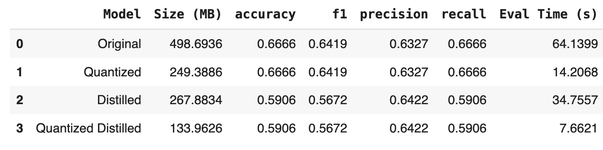

<h1 align="center">Patent Classification with Transformers</h1>
<h2 align="center">Advanced NLP - Final Project</h2>
<p align="center">
  <b>Ferran Boada Bergadà, Lucia Sauer, Julian Romero & Moritz Peist</b><br>
  Barcelona School of Economics · 2025
</p>

<p align="center">
  
  
  

</p>

---

## 🧠 Project Overview

This project focuses on **classifying patent documents** using only their abstracts into 9 categories based on the **Cooperative Patent Classification (CPC)** scheme. We leverage the [`ccdv/patent-classification`](https://huggingface.co/datasets/ccdv/patent-classification) dataset from Hugging Face, which originates from **Google Patents Public Datasets via BigQuery** (Google, 2018).

Originally designed for **abstractive summarization**, this dataset is repurposed here for **multi-class classification**. It consists of:

- **25,000 training samples**
- **5,000 samples for validation and testing respectively**
- Abstract patent texts and associated 9 CPC labels

### 📊 Dataset Distribution

The dataset shows strong class imbalance, with most patents concentrated in a few categories—especially from fast-evolving fields like electronics and healthcare. This is common in patent corpora and follows a Pareto-like distribution, as noted by [Benzineb & Guyot (2011)](#ref1).

To evaluate performance on our imbalanced dataset, we use the **Weighted F1** score. It accounts for both precision and recall across all classes, while weighting each class by its frequency—providing a balanced view that reflects real-world class distributions.

<div align="center">

</div>

Patent documents are inherently long and complex, typically comprising multiple sections such as the **title**, **abstract**, **detailed description**, and **claims**. As illustrated in the plots below, the length of full patent texts varies dramatically across categories, with a **heavily right-skewed distribution** and some documents reaching up to **80,000 tokens**.

This high variability introduces significant **computational and modeling challenges**, especially for transformer-based architectures, which are generally constrained by maximum input lengths (e.g., 512 or 1024 tokens). Feeding full patent texts into such models often requires aggressive truncation or specialized architectures, increasing complexity.

To simplify the problem, we instead use **only the abstract section** of each patent. As shown in the side-by-side plots, abstracts are not only **substantially shorter**, but also exhibit a **more consistent distribution** across categories. This reduction in length:

- Decreases memory and computational requirements,
- Enables the use of standard transformer models without modification,
- And still captures essential semantic content for classification.

Thus, focusing on abstracts offers a practical trade-off between model efficiency and task relevance.

<table>
  <tr>
    <td></td>
    <td></td>
  </tr>
</table>

To explore vocabulary differences across categories, the following word clouds visualize the most frequent terms per class. While **domain-specific terms** clearly emerge, many words are **shared across categories**, introducing ambiguity and making it harder for models to distinguish between classes. Additionally, patents often contain **dense scientific language** and are **intentionally phrased in complex or obfuscated ways**—either to avoid plagiarism or obscure related inventions. These characteristics amplify the challenge of accurate classification, as key signals may be both rare and linguistically subtle.

<div align="center">
  
</div>

---

## 🎯 Objective, Challenges & Relevance

The goal of this project is to **automate the classification of patents** into CPC categories using modern Transformer-based models. Accurate classification is critical for routing patents to the right domain experts, accelerating the innovation pipeline and reducing administrative burden.

However, the task comes with significant challenges:

- The dataset is **highly imbalanced**, reflecting real-world skew in patent filings.
- **Patent texts are long**, often surpassing the 512-token limit of base Transformer models, which we simplify by only using the abstracts.
- **Technical vocabulary** and subtle distinctions between classes add further complexity.

Despite these challenges, **automating patent classification** has important real-world impact. It helps address the increasing volume and complexity of patent filings, reduces manual workload for experts, and ensures more consistent and scalable classification—ultimately speeding up how innovation is reviewed and protected.

> As a baseline, our rule-based classifier—built on class-specific keyword frequencies—achieves a weighted F1 score of 38%, highlighting the need for more powerful models like Transformers to handle the task's complexity and nuance.
---

## 📈 Related Work & SOA Benchmarks

Below is a comparison of recent studies tackling the patent classification task using machine learning and Transformer-based architectures:

| Model / Method                     | Dataset Used                                   | #Classes | Performance                  | Reference |
|----------------------------------|--------------------------------------------------|----------|------------------------------|-----------|
| PatentSBERTa + KNN           | Custom Patent Dataset (patent claims)           | CPC (663) | 66.0   (F1)                 | [Bekamiri et al. (2024)](#ref1) |
| LSG-Norm Attention (128/4)       | ccdv/patent-classification                       | CPC  (9) | 70.0 / 64.4  (Micro / Macro) | [Condevaux & Harispe (2023)](#ref2) |
| RoBERTa (512 tokens)             | ccdv/patent-classification                       | CPC  (9) | 66.6 / 61.8  (Micro / Macro) | [Condevaux & Harispe (2023)](#ref3) |
| PatentBERT                       | USPTO-3M (claims only)                           | CPC  (9) | 66.80   (F1)                 | [Lee & Hsiang (2020)](#ref4) |
| Linguistically-Supported KNN | CLEF-IP Dataset (699K patents)                  | CPC/IPC | Comparable to fastText      | [Yadrintsev et al. (2018)](#ref5) |
| Optimized Neural Networks (MLP)  | WIPO-alpha (English patents)                     | CPC  (9) | —      (Accuracy)            | [Abdelgawad et al. (2022)](#ref6) |

While previous work leverages large-scale datasets and high-compute environments to push the limits of model performance, our goal is to **replicate and benchmark results under realistic constraints**. Unlike studies using millions of patents or custom attention mechanisms (e.g., LSG-Norm), we focus on **pretrained Transformer models like RoBERTa**. Given our limited computational resources and time, our objective is to **evaluate how well standard models perform out-of-the-box** on this challenging task and understand their limitations in a resource-constrained setting.

---

## [🎲 Part 1: Random Classifier Performance](./code/task1.ipynb)

To establish a **baseline**, we begin by evaluating the performance of several **simpler models**. These methods serve as reference points to assess the added value of more sophisticated approaches like Transformer-based architectures.

- **Stemming + TF-IDF + Logistic Regression**: A classic text classification pipeline where stemming reduces vocabulary size and TF-IDF captures token importance.
- **TF-IDF Weighted Word2Vec + Logistic Regression**: Combines local token weighting (TF-IDF) with pretrained semantic embeddings to enrich document representation.
- **Word2Vec + RNN**: Leverages sequential modeling of dense word embeddings to capture contextual patterns in the text.

<div align="center">
  
</div>

The results align well with the expected trade-off between model complexity and performance. As the models incorporate deeper semantic representation and contextual information, we observe incremental improvements in classification effectiveness.

This progression confirms that **each added layer of linguistic complexity contributes to better performance**, and suggests that moving toward **contextual embedding models**—such as **RoBERTa**—is a promising direction.

---

## [🤖 Part 2: RoBERTa Model with Limited Data](./code/task2.ipynb)

_Discaimer: from here on all notebooks were created on Google Colab. The notebooks from Colab currently face an [open issue](https://github.com/googlecolab/colabtools/issues/5256#issuecomment-2795231057) on GitHub and can't often be rendered and hence properly displayed. We fixed the notebooks, but the fix leads to HuggingFace progress bars not being displayed correctly. The GitHub version of the notebooks also, doesn't support word highlighting of the `bert_interpretability_analysis()`, but this still works locally._

 Building on the previous experiments, which showed strong performance given their simplicity, we now turn to contextual language models—specifically RoBERTa, that is designed to capture rich semantic and syntactic dependencies, which may be especially valuable for domain-specific and complex texts like patents.

### Few Shot Learning

This section explores a few-shot learning setup where we fine-tune a pre-trained BERT model using only 32 labeled patent examples. The goal is to assess how well BERT can generalize with minimal supervision by leveraging its strong language understanding from pretraining.

### Data Augmentation - Sentence Shuffling

To address data scarcity, we explore automated augmentation via sentence shuffling, based on the observation that patent documents often contain independent technical claims that can be reordered without affecting the overall classification.

### Zero Shot Learning

Here, we evaluate how well an LLM (Mistral) can classify patents without fine-tuning, relying on its general knowledge and a well-crafted prompt.

### Data Generation with LLM

This section leverages an LLM to generate new labeled patent-like texts for underrepresented categories. These synthetic samples are added to the original 32 examples to retrain BERT.

### Optimal Technique Application

The final section applies the best-performing techniques from previous experiments to the full dataset, including:

- **Approach 1:** Using all generated/augmented data to fine-tune RoBERTa.
- **Approach 2:** Using SetFit on a RoBERTa model and the best performing data to leverage sentence embeddings for classification.

### Results

Final results are compared against the baseline and previous models, demonstrating the effectiveness of these techniques in improving classification performance, cf.:

<div align="center">
  
</div>

**Core Finding:** RoBERTa's bidirectional encoder architecture achieved 29.20% accuracy with 32 training samples, reaching 41.46% when combined with SetFit's contrastive sentence transformer approach compared to approx. 66% SOA with older BERT models ([Lee, J.-S., & Hsiang, J., 2020](https://www.sciencedirect.com/science/article/pii/S0172219019300742)) and current state-of-the-art performance (73-84%, [Bekamiri H. et al., 2024](https://www.sciencedirect.com/science/article/pii/S0040162524003329)) while using <1% of typical training data (32 vs 3,000+ samples per class).

**Technical Limitations Identified:**

- Transformer self-attention mechanisms consistently confused Physics↔Electricity patents due to shared technical vocabulary ("signal," "circuit," "device"), with this confusion persisting across all architectures tested
- Token-level attribution analysis revealed models rely on surface-level keyword matching rather than contextual semantic understanding, limiting classification effectiveness
- Class imbalance (9:1 ratio between majority/minority classes) and cross-sectional classes (e.g., cross-tech tagging) fundamentally constrain performance regardless of architecture sophistication

**Architecture-Specific Insights:**

- RoBERTa's removal of Next Sentence Prediction slightly improved single-document classification over an initial but removed BERT baseline
- SetFit's two-stage approach (frozen sentence transformer + lightweight classification head) proved superior to end-to-end fine-tuning for few-shot scenarios
- LLM-generated synthetic data (+6.96pp improvement) outperformed structural augmentation (+3.12pp), suggesting content quality matters more in our scenario than data quantity in transformer training.

---

## [🎨 Part 3: State of the Art Comparison](./code/task3.ipynb)

<div align="center">
  
</div>

The image above illustrates the performance of RoBERTa on patent classification as a function of the proportion of training data used. Notably, training with just 10% of the data already achieves a Weighted F1 score of nearly 60%, and using 50% boosts this to approximately 67%. Beyond this point, additional data yields diminishing returns, with the score plateauing around 66–67%, and reaching about 69% at full training capacity.

Overall, RoBERTa demonstrates strong performance that approaches state-of-the-art (SOA) benchmarks, despite utilizing fewer computational resources and less training data compared to the SOA models. This highlights RoBERTa's efficiency and robustness for the task.

---

## [💥 Part 4: Model Distillation/Quantization](./code/task4.ipynb)

This section focuses on optimizing the best-performing RoBERTa model for **faster and lighter inference** using **knowledge distillation** and **half-precision (FP16) quantization**.

### 🔄 Knowledge Distillation

We trained a compact **DistilBERT student model** to mimic the teacher model's predictions via a custom `DistillationTrainer`. This combines supervised cross-entropy loss with a **Kullback-Leibler divergence** between the teacher’s and student’s soft predictions. The combination of `α = 0.5` and `temperature = 4.0` allows the student to learn both from ground-truth labels and the richer output distribution of the teacher.

### ⚡ FP16 Quantization (Half Precision)

To reduce inference latency and memory usage on GPU, we applied **FP16 quantization** by converting the model to half-precision. Unlike PyTorch’s dynamic quantization (which was initially tested for CPU), **FP16 was ultimately used for evaluation and comparison**, as it allows full GPU acceleration with no retraining required.

This quantization was applied to both the original RoBERTa and the distilled DistilBERT model, resulting in four variants:

1. **Original RoBERTa (FP32)**
2. **Quantized (Original + FP16)**
3. **Distilled Student (FP32)**
4. **Quantized Distilled (Student + FP16)**

### 📊 Final Comparison Table

<div align="center">
  
</div>

- **Size**: Quantized Distilled is the smallest model at just 134 MB (~73% smaller than the original).
- **Speed**: Inference time drops drastically—Quantized Distilled is ~9× faster than the original.
- **Performance**: The distilled variants show a ~7.5pp drop in F1 score but actually gain slightly in **precision**, indicating more conservative classification behavior for 8 of the 9 labels.

---

## 📚 References

1. <a id="ref1"></a>Bekamiri, H., Hain, D. S., & Jurowetzki, R. (2024). PatentSBERTa: A deep NLP based hybrid model for patent distance and classification using augmented SBERT. _Technological Forecasting and Social Change_, 206, 123536.
2. <a id="ref2"></a>Condevaux, C., & Harispe, S. (2023). LSG-Norm Attention for patent classification.
3. <a id="ref3"></a>Condevaux, C., & Harispe, S. (2023). RoBERTa for patent classification.
4. <a id="ref4"></a>Lee, J. S., & Hsiang, J. (2020). PatentBERT: Patent classification with fine-tuning a pre-trained BERT model.
5. <a id="ref5"></a>Yadrintsev, V., Bakarov, A., Suvorov, R., & Sochenkov, I. (2018). Fast and accurate patent classification in search engines.
6. <a id="ref6"></a>Abdelgawad, L., et al. (2022). Optimized neural networks for patent classification.

## ⚙️ Project Structure

```bash
anlp_final_project/
├── code/                       # Jupyter Notebooks for each exercise
│   ├── 📓 task1.ipynb          # Solution to Part 1 
│   │── 📓 task2.ipynb          # Solution to Part 2  
│   │── 📓 task3.ipynb          # Solution to Part 3  
│   │── 📓 task4.ipynb          # Solution to Part 4
│   │── 🧰 utils.py             # Utilities
├── results/                    # Plots and model evaluations
│   ├── plots/
├── uv.lock                     # Environment UV lock file
├── pyproject.toml              # Environment UV dependencies
├── .python-version             # Environment UV python version
└── README.md                   # Executive summary
````
